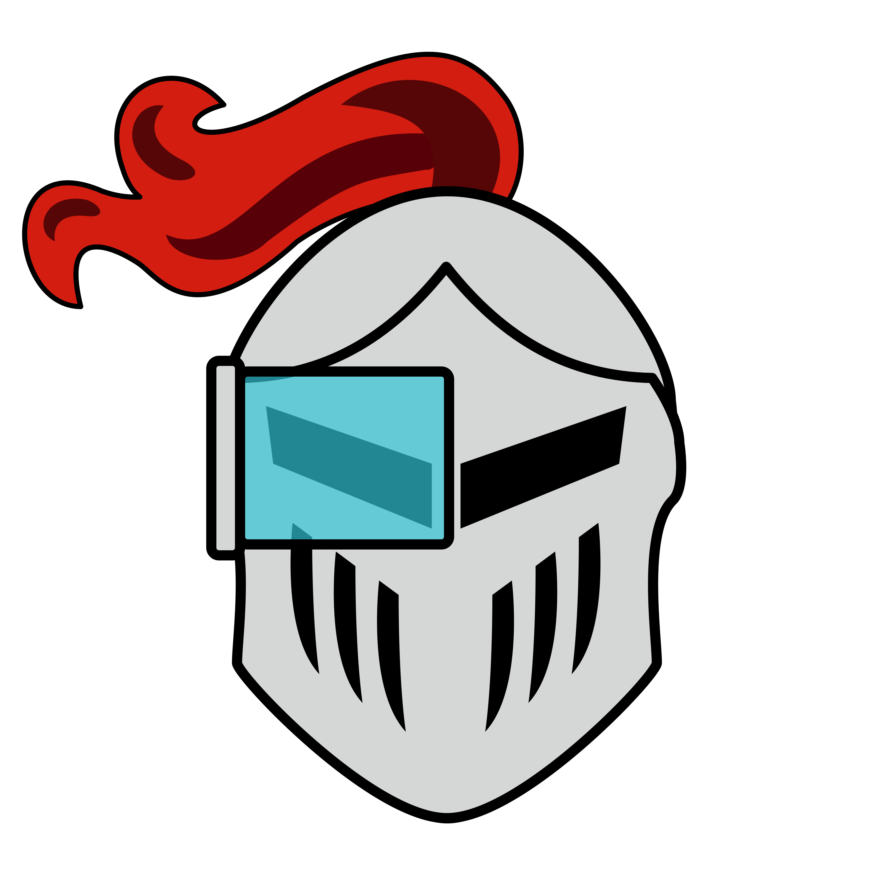
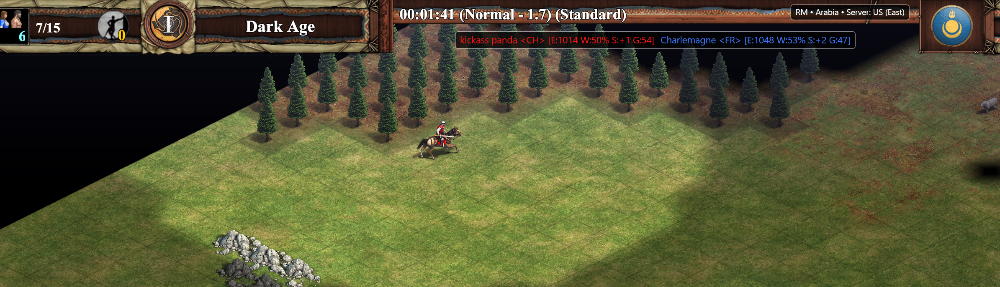

# Aoe2DEOverlay

Aoe2 DE ELO Overlay  

## Install Overlay

For an easy installation the latest version can be downloaded from github [releases](https://github.com/kickass-panda/Aoe2DEOverlay/releases). There is a x64 (64-bit CPU) or x86 (32-bit CPU) version. Unzip the file and copy the folder to a desired location. 

## Setup ProfileId

First we need the ProfileId from [aoe2.net](https://aoe2.net/). On the website under Leaderboards you find the choice between `Random Map`, `Team Random Map`, `Empires Wars`, `Team Empires Wars` and `Unranked`. Select one of the game modes in which you have played at least 10 games. After that you can search for your name with the search input field. Then click on your name and a dialog will open. In the dialog click on profiles to get to the profiles page. In the address bar you will find the ProfileId. Copy it and paste it in the setting.json as value (replace null) for `profileId`. You can open the setting.json file with the windows editor.

Example:

    profileId: 123

## Start

Run the `Aoe2DEOverlay.exe` to start the overlay. Now the last or currently playing match is automatically displayed. The update can sometimes take a few seconds after the match start. 

## Layouting

By default it is displayed in the top center. You can adjust the `horizontal` alignment by set the `left`, `right`, or `center` values in the `setting.json`. For the `vertical` alignment you can use the values `top`, `bottom`, or `center`.

Example:

    "vertical": "top",
    "horizontal": "center",

Example:

    "bottom": 50,
    "right": 700,

## Formatting

### Player Raiting

It automatically detects if the match is RM or EW and loads the correct data for `1v1` and `team` accordingly.

It is possible to display differently format for 1v1 (`format1v1`) or team (`formatTeam`) matches.

Example:

    "format1v1": "<{country}> [E:{1v1.elo} W:{1v1.rate} S:{1v1.streak} G:{1v1.games}]",
    "formatTeam": "{name} <{country}> [E:{1v1.elo} T:{team.elo}])",

| Placeholder     | Description                                                     |
| :-------------- | :-------------------------------------------------------------- |
| `{slot}`        | The match slot of the player                                    |
| `{name}`        | Name of the player                                              |
| `{country}`     | Country of the player                                           |
| `{civ}`         | Civilisation the player plays                                   |
| `{1v1.rank}`    | The leaderboard 1v1 rank position of the player                 |
| `{1v1.elo}`     | The 1v1 elo points of the player                                |
| `{1v1.rate}`    | The 1v1 win rate of the player                                  |
| `{1v1.streak}`  | The 1v1 streak of wining or loosing matches of the player       |
| `{1v1.games}`   | The number of 1v1 matches the player has played                 |
| `{1v1.wins}`    | The number of 1v1 matches the player has won                    |
| `{1v1.losses}`  | The number of 1v1 matches the player has lost                   |
| `{team.rank}`   | The leaderboard team game rank position of the player           |
| `{team.elo}`    | The team game elo points of the player                          |
| `{team.rate}`   | The team game win rate of the player                            |
| `{team.streak}` | The team game streak of wining or loosing matches of the player |
| `{team.games}`  | The number of team matches the player has played                |
| `{team.wins}`   | The number of team matches the player has won                   |
| `{team.losses}` | The number of team matches the player has lost                  |

### Match Info

Example:

    server: {
        "format": "s: {server} m: {mode.name}",
    }

| Placeholder     | Description                                                                                        |
| :-------------- | :------------------------------------------------------------------------------------------------- |
| `{server.key}`  | The game server id of the match (example: `"eastus"`)                                              |
| `{server.name}` | The game server name of the match (example: `"US (East)"`)                                         |
| `{mode.name}`   | The mode name of the match Unranked, Deathmatch, Random Map, Empire Wars                           |
| `{mode.short}`  | The mode short name of the match UR (Unranked), DM (Deathmatch), RM (Random Map), EW (Empire Wars) |
| `{map.name}`    | The name of the current map played                                                                      |

## Theming
S
The player and also the panel colours can be customised in the `setting.json`.
The color can set to `backgroundColor`, `borderColor`, `player1Color`, …, `player8Color`.
For RGB color use hex like `#3C78FF` (Red: `3C`, Green: `78`, Blue: `FF`).
For RGBA color use hex like `#BB000000` (Alpha: `BB` Red: `00`, Green: `00`, Blue: `00`).  
